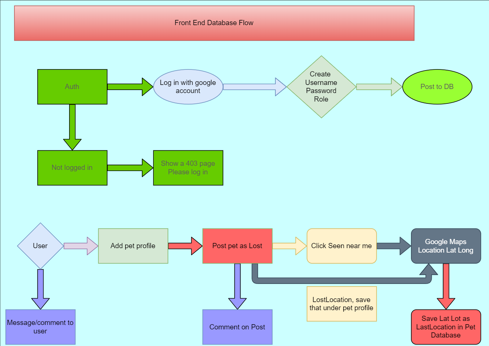

<div id="top"></div>
<!--
*** Thanks for checking out the Best-README-Template. If you have a suggestion
*** that would make this better, please fork the repo and create a pull request
*** or simply open an issue with the tag "enhancement".
*** Don't forget to give the project a star!
*** Thanks again! Now go create something AMAZING! :D
-->

<!-- PROJECT SHIELDS -->
<!--
*** I'm using markdown "reference style" links for readability.
*** Reference links are enclosed in brackets [ ] instead of parentheses ( ).
*** See the bottom of this document for the declaration of the reference variables
*** for contributors-url, forks-url, etc. This is an optional, concise syntax you may use.
*** https://www.markdownguide.org/basic-syntax/#reference-style-links
-->

<!-- [![Checks][check-sheild]][check-url] -->
<!-- [![codecov][codecov-sheild]][codecov-url] -->

[![Contributors][contributors-shield]][contributors-url]
[![Forks][forks-shield]][forks-url]
[![Stargazers][stars-shield]][stars-url]
[![Issues][issues-shield]][issues-url]
[![MIT License][license-shield]][license-url]

<!-- PROJECT LOGO -->
<br />
<!-- TODO ADD LOGO 
<div align="center">
  <a href="https://github.com/Floof-Finders">
    
  </a>
-->

# Lost Pet Finder 9000

<!-- TABLE OF CONTENTS -->
<div>
  <summary>Table of Contents</summary>
  <ol>
    <li><a href="#about-the-project">About The Project</a></li>
    <li><a href="#getting-started">Getting Started</a></li>
    <!-- TODO <li><a href="#usage">Usage</a></li>
    <li><a href="#roadmap">Roadmap</a></li> -->
    <li><a href="#contributing">Contributing</a></li>
    <li><a href="#license">License</a></li>
    <li><a href="#contact">Contact</a></li>
    <li><a href="#acknowledgments">Acknowledgments</a></li>
  </ol>
</div>

<!-- ABOUT THE PROJECT -->

## About The Project

> Lost Pet Finder is an application that allows users to interact with others to find their lost pets. It also allows users to post animals they have found with their locations to hopefully help them find their way home.

## UML




### Built With

- [Axios](https://www.npmjs.com/package/axios)
- [Babel](https://www.npmjs.com/package/@babel/core)
- [ReactBootStrap](https://www.npmjs.com/package/react-bootstrap)
- [Cors](https://www.npmjs.com/package/cors)
- [Dotenv](https://www.npmjs.com/package/dotenv)
- [ESLint](https://eslint.org/)
- [Jest](https://jestjs.io/)
- [ReactCookies](https://www.npmjs.com/package/react-cookie)
- [ReactRouter](https://www.npmjs.com/package/react-router)
- [ReactTestingLibrary](https://www.npmjs.com/package/@testing-library/react)
- [NodeJS](https://nodejs.org/en/)
- [Moment](https://momentjs.com/)
- [@react-google-maps/api](https://www.npmjs.com/package/@react-google-maps/api)

## Getting Started

```sh
# Install NPM
npm install npm@latest -g

# Clone the repository
git clone git@github.com:Floof-finders/lost-pet-finder-frontend.git

# Install dependencies
npm install

# Running locally
npm run dev

# Running tests
npm run test
```

## Optional for using in Production Environment

Request API Key from:

- [Google Maps API Key](https://developers.google.com/maps/documentation/javascript/get-api-key)
- [Auth0-Domain-Key&Client-ID](https://auth0.com/docs)

Copy `.SAMPLEenv` file, and rename to `.env` file, and update the keys

## Usage

- Log in through Google
- Create a profile
- Add pets to the Profile
- Post to Lost and Found board
- Filter through Lost or Found pets
- Comment on each pet
- Create time stamps and markers on an interactive map

### Deployment

[Heroku Deployment](https://lost-pet-finder-backend.herokuapp.com/)<br />
[Netlify Deployment](https://lost-pet-finder-frontend.netlify.app/)

See the [open issues](https://github.com/Floof-Finders/issues) for a full list of proposed features (and known issues).

<!-- CONTRIBUTING -->

## Contributing

Contributions are what make the open source community such an amazing place to learn, inspire, and create. Any contributions you make are **greatly appreciated**.

If you have a suggestion that would make this better, please fork the repo and create a pull request. You can also simply open an issue with the tag "enhancement".
Don't forget to give the project a star! Thanks again!

1. Fork the Project
2. Create your Feature Branch (`git checkout -b feature/AmazingFeature`)
3. Commit your Changes (`git commit -m 'Add some AmazingFeature'`)
4. Push to the Branch (`git push origin feature/AmazingFeature`)
5. Open a Pull Request

<!-- LICENSE -->

## License

Distributed under the MIT License. See `LICENSE.txt` for more information.

<!-- CONTACT -->

## Contact

Heather Bisgaard - [@vbchomp](https://github.com/vbchomp) - [LinkedIn Profile](https://www.linkedin.com/in/heather-bisgaard/) - vbchomp@gmail.com  
Charlie Fadness - [@fadnesscharlie](https://github.com/fadnesscharlie) - [LinkedIn Profile](https://www.linkedin.com/in/cfadness/) - fadness.charlie@outlook.com  
Mark Thanadabouth - [@markjackson28](https://github.com/markjackson28) - [LinkedIn Profile](linkedin.com/in/markjackson28) - mark28ten@gmail.com

Project Link: [https://github.com/Floof-Finders](https://github.com/Floof-Finders)

<!-- ACKNOWLEDGMENTS -->

## Acknowledgments

- TA's:
  - Kassie Bradshaw
- [Socket.io Stack Overflow](https://stackoverflow.com/questions/62208654/notification-system-using-socket-io)
- [push notifications with socket.io](https://hetaram37.medium.com/real-time-notifications-using-socket-io-nodejs-and-angular-ec2df283d00b)
- [Placeholder.com Images](https://placeholder.com/)
- [Placehold.jp Images](http://placehold.jp/)
- [Google Maps & Google Places in React](https://www.youtube.com/watch?v=WZcxJGmLbSo)
- [SVG Silh - Paw SVG](https://svgsilh.com/image/1314467.html)
- [Bootstrap Icons](https://icons.getbootstrap.com/#usage)
- [Jest IO](https://jestjs.io/docs/tutorial-react)

<p align="right">(<a href="#top">back to top</a>)</p>

<!-- MARKDOWN LINKS & IMAGES -->
<!-- https://www.markdownguide.org/basic-syntax/#reference-style-links -->

[contributors-shield]: https://img.shields.io/github/contributors/Floof-Finders/lost-pet-finder-frontend.svg
[contributors-url]: https://github.com/Floof-Finders/lost-pet-finder-frontend/graphs/contributors
[forks-shield]: https://img.shields.io/github/forks/Floof-Finders/lost-pet-finder-frontend.svg
[forks-url]: https://github.com/Floof-Finders/lost-pet-finder-frontend/network/members
[stars-shield]: https://img.shields.io/github/stars/Floof-Finders/lost-pet-finder-frontend.svg
[stars-url]: https://github.com/Floof-Finders/lost-pet-finder-frontend/stargazers
[issues-shield]: https://img.shields.io/github/issues/Floof-Finders/lost-pet-finder-frontend
[issues-url]: https://github.com/Floof-Finders/lost-pet-finder-frontend/issues
[license-shield]: https://img.shields.io/github/license/Floof-Finders/lost-pet-finder-frontend.svg
[license-url]: https://github.com/Floof-Finders/lost-pet-finder-frontend/blob/master/LICENSE.txt
[check-sheild]: https://github.com/Floof-Finders/actions/workflows/checks.yaml/badge.svg
[check-url]: https://github.com/Floof-Finders/lost-pet-finder-frontend/actions/workflows/checks.yaml
[codecov-sheild]: https://codecov.io/gh/Floof-Finders/lost-pet-finder-frontend/branch/main/graph/badge.svg?token=7SL7D08EZB
[codecov-url]: https://codecov.io/gh/Floof-Finders/lost-pet-finder-frontend
